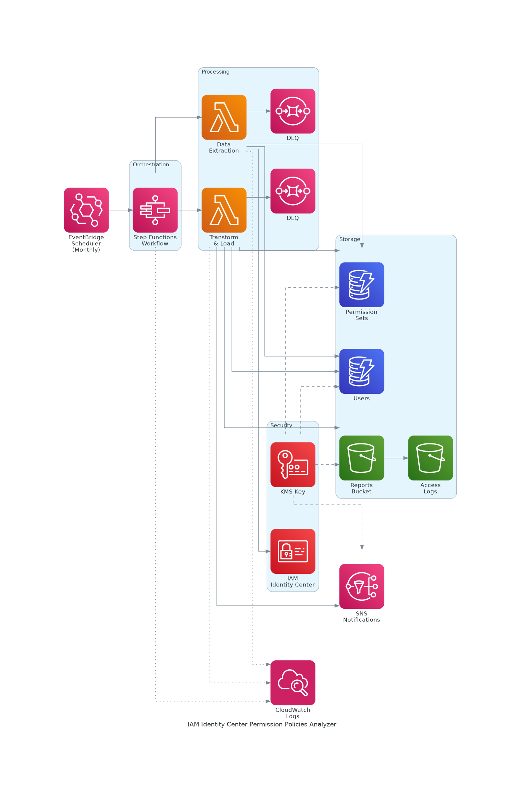

# AWS IAM Identity Center Permission Policies Analyzer

Automated monthly analysis of AWS IAM Identity Center users and their permission policies, generating comprehensive CSV reports.

## Architecture



### Components

| Component | Purpose |
|-----------|---------|
| EventBridge Scheduler | Monthly trigger |
| Step Functions | Workflow orchestration with retry/catch |
| Lambda (Extraction) | Extract users, groups, permission sets from Identity Center |
| Lambda (Transform) | Generate CSV report, upload to S3, send notification |
| DynamoDB | Store extracted data with TTL |
| S3 | Store reports with lifecycle policy |
| SNS | Email notifications |
| KMS | Encrypt all data at rest |
| SQS (DLQ) | Capture failed Lambda invocations |
| CloudWatch | Logs and X-Ray tracing |

## Features

- **Automated Analysis**: Monthly scheduled analysis of all Identity Center users
- **Comprehensive Reports**: CSV reports with users, groups, permission sets, and policies
- **Security First**: KMS encryption, least privilege IAM, access logging
- **Serverless**: Pay-per-use with no infrastructure to manage
- **Observable**: X-Ray tracing, CloudWatch logs, SNS notifications

## Prerequisites

- AWS Account with [IAM Identity Center](https://aws.amazon.com/iam/identity-center/) enabled
- [AWS SAM CLI](https://docs.aws.amazon.com/serverless-application-model/latest/developerguide/install-sam-cli.html) installed
- Identity Store ID and Instance ARN ([how to find](https://docs.aws.amazon.com/singlesignon/latest/userguide/get-started-prereqs-considerations.html))

## Quick Start

### 1. Clone & Deploy

```bash
git clone https://github.com/vanhoangkha/aws-iam-identity-center-permission-policies-analyzer.git
cd aws-iam-identity-center-permission-policies-analyzer

sam build
sam deploy --guided
```

### 2. Parameters

| Parameter | Description | Example |
|-----------|-------------|---------|
| `EmailAddress` | Notification email | `admin@example.com` |
| `IdentityStoreID` | Identity Store ID | `d-1234567890` |
| `IdentityStoreInstanceArn` | SSO Instance ARN | `arn:aws:sso:::instance/ssoins-xxx` |
| `ReportRetentionDays` | Days to keep reports | `365` |
| `Environment` | Deployment environment | `prod` |

### 3. Confirm SNS Subscription

Check your email and confirm the SNS subscription to receive notifications.

## Report Output

The generated CSV report includes:

| Column | Description |
|--------|-------------|
| User | Username |
| PrincipalId | User or Group ID |
| PrincipalType | USER or GROUP |
| GroupName | Group name (if applicable) |
| AccountIdAssignment | AWS Account ID |
| PermissionSetARN | Permission Set ARN |
| PermissionSetName | Permission Set name |
| InlinePolicy | Inline policy JSON |
| CustomerManagedPolicy | Customer managed policies |
| AWSManagedPolicy | AWS managed policy ARNs |
| PermissionBoundary | Permission boundary details |

## Manual Execution

Trigger analysis manually via Step Functions console or CLI:

```bash
aws stepfunctions start-execution \
  --state-machine-arn <StateMachineArn> \
  --input '{
    "identityStoreId": "d-xxxxxxxxxx",
    "instanceArn": "arn:aws:sso:::instance/ssoins-xxx",
    "ssoDeployedRegion": "us-east-1"
  }'
```

## Security Features

| Feature | Implementation |
|---------|----------------|
| Encryption at Rest | KMS for DynamoDB, S3, SNS, SQS, CloudWatch Logs |
| Encryption in Transit | HTTPS-only S3 bucket policy |
| Access Control | Least privilege IAM, S3 Block Public Access |
| Data Protection | DynamoDB PITR, S3 versioning, TTL auto-cleanup |
| Resilience | Dead Letter Queues, Step Functions retry/catch |
| Observability | X-Ray tracing, CloudWatch Logs with retention |

## Testing

```bash
# Create virtual environment
python3 -m venv .venv
source .venv/bin/activate
pip install pytest boto3

# Run tests
cd src/dataExtractionFunction && pytest test_extraction.py -v
cd ../dataTransformLoadFunction && pytest test_transform.py -v
```

## Cleanup

```bash
# Empty S3 buckets first
aws s3 rm s3://<stack-name>-reports-<account-id> --recursive
aws s3 rm s3://<stack-name>-access-logs-<account-id> --recursive

# Delete stack
sam delete --stack-name <stack-name>
```

## Project Structure

```
.
├── template.yaml                 # SAM template
├── src/
│   ├── dataExtractionFunction/   # Extracts Identity Center data
│   │   ├── handler.py
│   │   ├── requirements.txt
│   │   └── test_extraction.py
│   └── dataTransformLoadFunction/ # Generates CSV reports
│       ├── handler.py
│       ├── requirements.txt
│       └── test_transform.py
└── README.md
```

## Contributing

Contributions welcome! Please read [CONTRIBUTING.md](CONTRIBUTING.md) first.

## License

This project is licensed under the MIT-0 License - see [LICENSE](LICENSE) file.

## Acknowledgments

- Original project by [AWS Samples](https://github.com/aws-samples/aws-iam-identity-center-permission-policies-analyzer)
- Built with [AWS SAM](https://aws.amazon.com/serverless/sam/)
